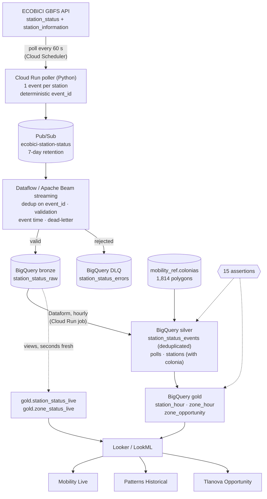

# CDMX Mobility Streaming Analytics


A streaming pipeline on Google Cloud for **ECOBICI**, Mexico City's public bike system. Every minute a poller reads the live feed of all 677 stations and publishes one event per station. A **Dataflow** job validates the events and streams them into **BigQuery**, and **Dataform** turns them into availability, trips and unmet demand per colonia and hour. Three **Looker** dashboards sit on top: what is happening now, the patterns over time, and where riders find no bike. Those empty stations are the gap a ride or courier service like Tlanova could fill.

Data: [ECOBICI GBFS feed](https://gbfs.mex.lyftbikes.com/gbfs/gbfs.json) (open, updated every ~10 s) and the [colonias of Mexico City](https://datos.cdmx.gob.mx/dataset/coloniascdmx) (IECM, Portal de Datos Abiertos CDMX).

## Architecture



## Status

Deployed on project `flow-eed16` on 2026-10-03 and collecting. First 26 minutes:

| | |
|---|---|
| Polls | 26 of 27 scheduled minutes (one lost to a redeploy) |
| Messages published | ~17,600 (677 per poll) |
| Distinct station states in bronze | 3,123 (about 97 per poll; the rest were repeats dropped by Dataflow) |
| Rejected to the DLQ | 0 |
| Pub/Sub publish → BigQuery row | p50 0.98 s, p95 1.5 s |
| Feed poll → BigQuery row | p50 1.4 s |
| Stations matched to a colonia | 677 of 677, in 144 colonias across 6 alcaldías |
| Stations stale at poll time (no report in over an hour) | ~20–28, kept and flagged |

The opportunity ranking needs days of history: every row says how many days back it, and anything under three days per day type is labeled `confidence = low`. A first look at Saturday 10:00–12:00 already puts the colonias Cuauhtémoc (along Reforma) and Del Valle II at the top, with stations empty 20–30% of the time.

## How it works

**Poller** ([`poller/`](poller), Python on Cloud Run)
- Cloud Scheduler calls `POST /poll` every minute with an OIDC token; the service is private.
- Fetches `station_status` and `station_information` in parallel and publishes one JSON event per station, with the static attributes (name, coordinates, capacity) copied in so each event stands alone.
- **Deterministic ID**: `event_id = MEX-<station_id>-<last_reported>`. It identifies a station *state*, not a poll: a station that has not reported since the previous poll produces the same ID, and so do Scheduler retries and Pub/Sub redeliveries.
- Waits for every publish to be acknowledged before answering 200; a partial failure answers 502 and Scheduler retries, which is safe because the IDs repeat.
- Fields missing from the feed are sent as `null` rather than defaulted, so validation can reject them. Accepts GBFS v1/v2 (0/1) and v3 (true/false) booleans and numeric station IDs.

**Streaming** ([`pipeline/`](pipeline), Apache Beam on Dataflow)
- Reads the subscription with `id_label=event_id`: Dataflow drops repeats of a state within its 10-minute dedup window, so an idle station costs one row, not one per minute.
- **Validation** splits each message into a bronze row or a dead-letter row. Hard errors: unparseable JSON, unknown schema version, missing station or counts, an `event_id` that does not match station and `last_reported`, negative counts, wrong types, timestamps in the future or before the system started (2022-06-19). Soft problems keep the row with a warning: `stale_report`, `missing_station_information`, `counts_exceed_capacity`, `location_outside_cdmx`.
- **Event time** is the station's `last_reported`, stored as `event_ts` with `report_age_seconds`. The element timestamp stays at the Pub/Sub publish time on purpose: some stations have not reported for months, and using their report time as event time would drag the job's watermark back by that much.
- **Dead-letter**: rejected messages go to `station_status_errors` with the original payload and attributes, ready to replay. Rows BigQuery itself refuses (`failed_rows_with_errors`) land there too.

**Silver** ([`dataform/definitions/silver`](dataform/definitions/silver))
- `station_status_events`: incremental `MERGE` on `event_id`, one row per station state. Each run re-reads 30 minutes of bronze before its watermark for rows still in the streaming buffer; the merge makes the overlap harmless.
- `polls`: one row per poll that reached bronze. Gold samples at these instants, so an outage of the poller is unobserved time, not time a station sat empty.
- `stations`: latest attributes per station plus its colonia (point in polygon, nearest colonia within 150 m for stations on a boundary street).

**Gold** ([`dataform/definitions/gold`](dataform/definitions/gold))
- `station_hour`: an as-of join gives every station its last reported state at every poll (one sample per minute). A sample counts as observed only if the state was reported within the last 60 minutes by an installed station. Outputs empty, full, available and not-renting minutes, average bikes and docks. Trips come from changes in docked bikes (available plus disabled) between consecutive reports; a change of 5 bikes or more is a rebalancing truck and is counted separately.
- `zone_hour`: the same per colonia and hour.
- `zone_opportunity`: a typical week per colonia × weekday/weekend × hour. **Unmet departures** = each station's departure rate while it had bikes × the minutes it was empty, normalized per observed hour (a station empty the whole slot borrows its colonia's rate). That is the demand that existed but found no bike, ranked across all slots.
- `station_status_live`, `zone_status_live`: views over bronze for the live dashboard, as fresh as the stream rather than the last Dataform run.

**Data quality** (15 assertions, run with every build)
- Unique keys and required columns in every table; `bronze_reaches_silver` (every state in bronze before the watermark is in silver, catches a broken incremental filter); `zone_hour_reconciles` (departures, arrivals and empty minutes add up the same per station and per colonia); minutes that cannot exceed the samples; one state per station and instant.

**Looker** ([`looker/`](looker), LookML)
- Model, 4 views and 3 LookML dashboards: **Mobility Live** (KPIs, station map by status, colonias with empty stations; refreshes every minute), **Patterns Historical** (trips per hour, weekday × hour heat map of empty time, weekday vs weekend, colonias that drain or fill), **Tlanova Opportunity** (unmet trips per day, share of demand unmet, unmet by hour, ranking of colonia-hour slots).
- Ratios are measures over sums (`SUM(empty) / SUM(observed)`), never averages of hourly ratios, so they stay correct at any grouping.
- [`validate_lookml.py`](looker/validate_lookml.py) checks the project without a Looker instance: parses everything, checks every `${TABLE}.column` against BigQuery, resolves every field reference, filter and listener, then builds each tile's SQL and dry-runs it. All 20 tiles pass.

## Design decisions

- **Two layers of deduplication, one ID.** Dataflow's `id_label` removes most repeats in flight (in the first 26 minutes, 3,123 rows from 17,600 messages); the silver `MERGE` removes whatever crosses the 10-minute window or arrives after a restart. Both rely on the poller's deterministic ID, so the poller can stay stateless and retry freely.
- **Time-weighted availability by sampling, not by interval arithmetic.** Dataflow's dedup removes the repeats that would show how long a state lasted, so gold rebuilds it: every station at every poll, with its last known state. Missing polls become unobserved minutes instead of being filled in.
- **Trust window.** Stations re-send their state every few minutes while online (median report age about 6 minutes). A state older than an hour is treated as unknown, which keeps a station that has been offline for months from counting as "empty".
- **Live data skips the batch layer.** The live views read bronze directly (last 3 hours), so the live dashboard is seconds behind the feed, while the heavier gold tables rebuild hourly.
- **Least privilege.** Four service accounts: the poller can only publish to its topic, Dataflow can read its subscription and write bronze, Dataform reads bronze and writes silver/gold, Scheduler can only invoke the poller and the Dataform job.

## Limitations

- Trips are inferred from changes between reports: a bike taken and another returned between two reports cancel out, so departures and arrivals are lower bounds. Rebalancing is separated by size, not identified.
- Unmet demand assumes riders would have come at the rate seen while bikes were available. It ignores riders who walked to a nearby station.
- The LookML is validated against BigQuery, not on a Looker instance (Looker is licensed per instance).

## Repository

```
poller/        Python Cloud Run service (Flask + gunicorn), tests with GBFS fixtures
pipeline/      Apache Beam pipeline: validation, dead-letter, bronze writer; tests incl. poller contract
dataform/      silver, gold, assertions; Dockerfile for the hourly Cloud Run job
looker/        LookML model, views, dashboards and validate_lookml.py
reference/     load_colonias.sh: colonia polygons into BigQuery
infra/         setup.sh, deploy_poller.sh, run_dataflow.sh, deploy_dataform_job.sh, stop.sh
```

## Running it

```bash
# 1. Pub/Sub, bucket, datasets, bronze tables, service accounts (idempotent)
infra/setup.sh
reference/load_colonias.sh
# 2. Poller on Cloud Run + per-minute schedule
infra/deploy_poller.sh
# 3. Streaming job (Beam uses Application Default Credentials)
(cd pipeline && uv venv --python 3.12 .venv && uv pip install -r requirements.txt)
infra/run_dataflow.sh
# 4. Silver and gold every hour, or once by hand
infra/deploy_dataform_job.sh
(cd dataform && npx @dataform/cli@3.0.71 run)
# 5. LookML checks
(cd looker && uv venv --python 3.12 .venv && uv pip install -r requirements.txt && .venv/bin/python validate_lookml.py)
```

Tests: `poller/` 14 (pytest, against a local HTTP server with real feed fixtures), `pipeline/` 33 (validation rules, Beam pipeline split, and a contract test that feeds the poller's output into the pipeline's validation).

Cost: the Dataflow worker (one `n1-standard-1` with Streaming Engine) is most of it, roughly USD 2–3 per day; Cloud Run, Scheduler, Pub/Sub and BigQuery stay within cents at this volume. `infra/stop.sh` drains the job; the subscription keeps 7 days of events, so a new job catches up. `PAUSE_POLLER=1 infra/stop.sh` also pauses the poller.
