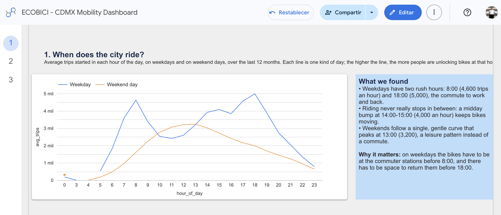
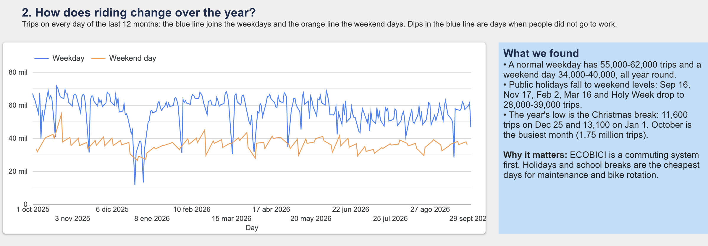
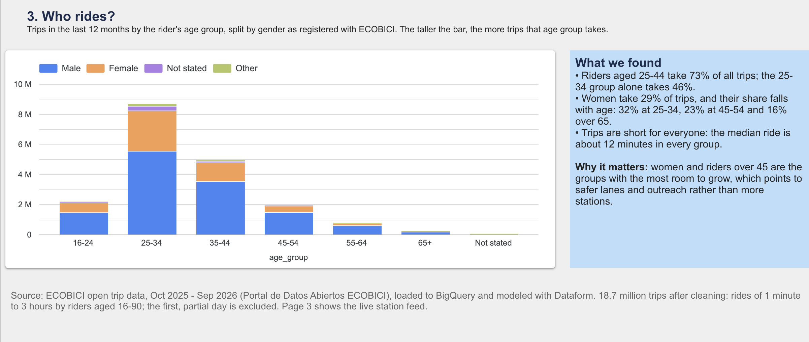
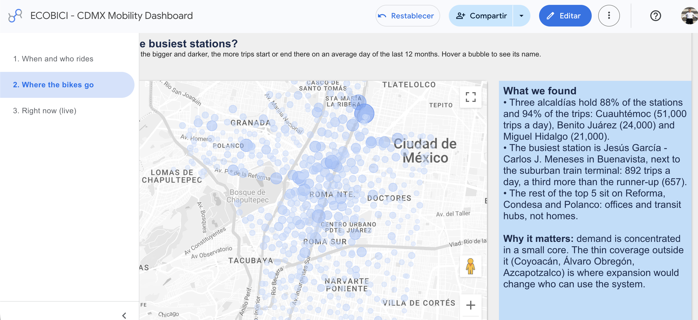
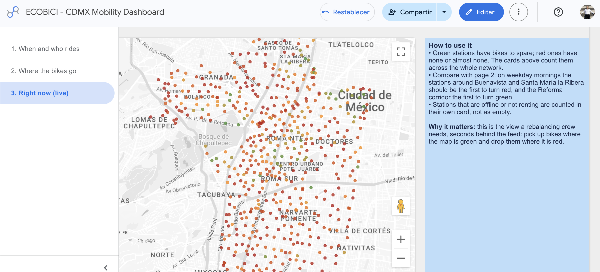
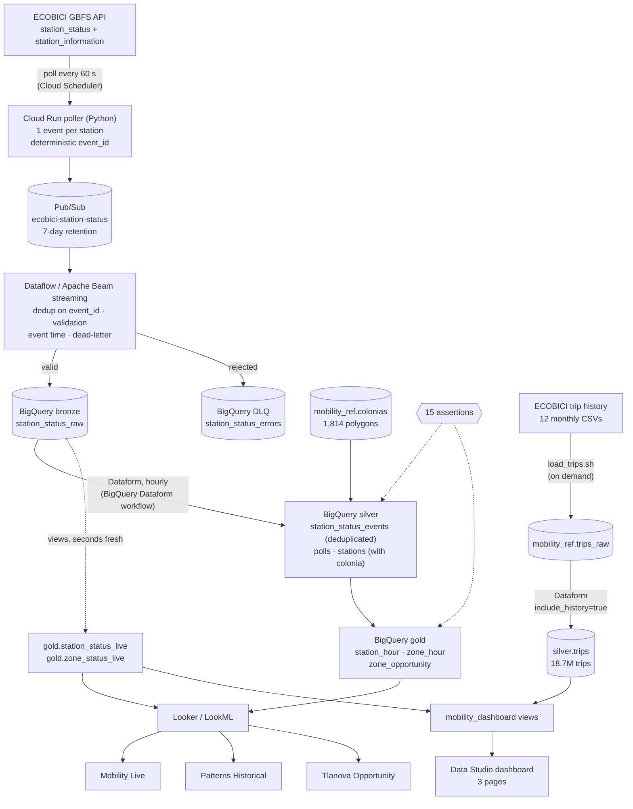
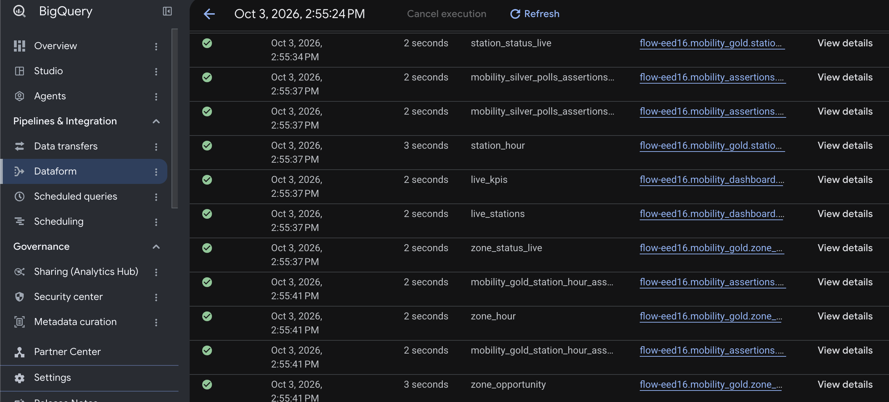
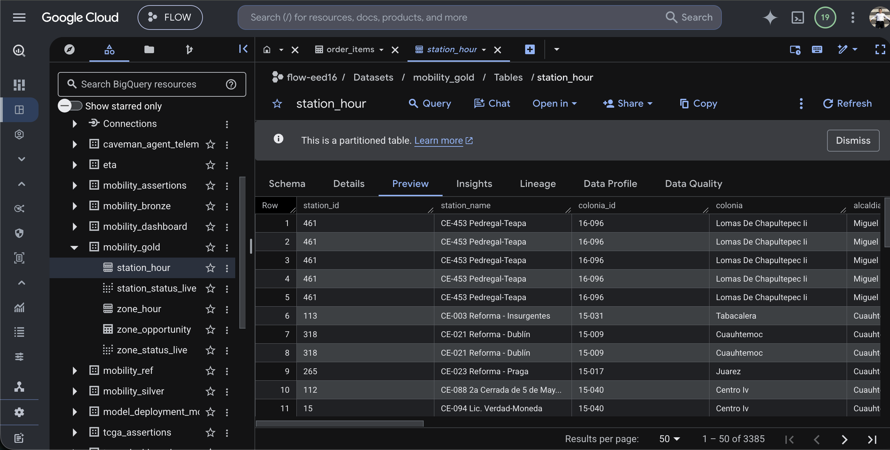

# CDMX Mobility Streaming Analytics


**ECOBICI**, Mexico City's public bike system, moves about 57,000 trips on a normal weekday across 677 stations. This project follows it on Google Cloud in two ways: a year of published trip history (18.7 million trips) to learn its patterns, and a live stream of every station, polled every minute, to see where riders find no bike right now. Those empty stations are the gap a ride or courier service like Tlanova could fill.

Data: [ECOBICI GBFS feed](https://gbfs.mex.lyftbikes.com/gbfs/gbfs.json) (open, updated every ~10 s), [ECOBICI open trip data](https://ecobici.cdmx.gob.mx/datos-abiertos/) (one CSV per month) and the [colonias of Mexico City](https://datos.cdmx.gob.mx/dataset/coloniascdmx) (IECM, Portal de Datos Abiertos CDMX).

## The story

The dashboard is built in Data Studio (formerly Looker Studio) on the views in `mobility_dashboard` ([`definitions/dashboard/`](definitions/dashboard)). Every chart answers one question and states what it shows.

### 1. When does the city ride?



ECOBICI is a commuter system first. Weekdays have two rush hours, 8:00 (4,600 trips an hour) and 18:00 (5,000), the ride to work and back, with a midday bump in between that keeps bikes moving. Weekends follow a single gentle curve that peaks at 13:00 (3,200). The practical consequence: on weekdays the bikes have to be at the commuter stations before 8:00, and there has to be room to return them before 18:00.

### 2. How does riding change over the year?



A normal weekday has 55,000–62,000 trips and a weekend day 34,000–40,000, all year round. Public holidays fall to weekend levels (Sep 16, Nov 17, Feb 2, Mar 16 and Holy Week), and the low of the year is the Christmas break: 11,600 trips on Dec 25 and 13,100 on Jan 1. October is the busiest month, with 1.75 million trips. Holidays and school breaks are the cheapest days for maintenance and bike rotation.

### 3. Who rides?



Riders aged 25–44 take 73% of all trips, and the 25–34 group alone takes 46%. Women take 29% of trips, and their share falls with age: 32% at 25–34, 23% at 45–54 and 16% over 65. Trips are short for everyone, about 12 minutes at the median in every group. Women and riders over 45 are where the system has the most room to grow, which points to safer lanes and outreach rather than more stations.

### 4. Where do the bikes go?



Demand is concentrated in a small core. Cuauhtémoc, Benito Juárez and Miguel Hidalgo hold 88% of the stations and 94% of the trips (51,000, 24,000 and 21,000 trip starts and ends a day). The busiest station is Jesús García – Carlos J. Meneses in Buenavista, next to the suburban train terminal, with 892 trip starts and ends a day, a third more than the runner-up (657). The rest of the top five sit on Reforma, in Condesa and in Polanco: offices and transit hubs, not homes.

The same page follows the morning commute: between 7:00 and 10:00 on a weekday, Buenavista II loses 376 bikes while the office districts along Reforma gain them (colonia Cuauhtémoc +531, Juárez +362). That one-way flow is why rebalancing trucks are needed every morning. The 50 most repeated routes are all short hops (median 2.5–12 minutes), many in out-and-back pairs.

### 5. Right now



The last page comes from the streaming layer, not the history: every station colored by how many of its docks hold a bike, seconds behind the feed. Green stations have bikes to spare and red ones have none or almost none. It is the view a rebalancing crew needs (pick up where the map is green, drop where it is red), and it is where the next question starts.

### 6. What comes next: where riders find no bike

The history shows when and where people ride; it cannot show the trips that never happened because a station was empty. The stream can. Gold estimates, for every colonia and hour of a typical week, the trips that could not start: each station's departure rate while it had bikes, times the minutes it sat empty (see [`zone_opportunity`](definitions/gold/zone_opportunity.sqlx)). Those colonia-hour slots are where a ride or courier service could offer the trip instead. The estimate needs days of streaming data; until a slot has three days behind it, it is labeled `confidence = low`. The first hours already point at the commuter core: colonia Cuauhtémoc and Del Valle II, with stations empty 20–30% of the time on a Saturday morning.

## How the data gets there



### Under the hood

The hourly Dataform workflow in BigQuery, building silver, gold, the live dashboard views and their assertions, every step green:



And the layers it builds, side by side in BigQuery (here `mobility_gold.station_hour`, one row per station and hour with its colonia):



## Status

Deployed on project `flow-eed16` on 2026-10-03 and collecting. First 4 hours 14 minutes (16:48–21:02 UTC):

| | |
|---|---|
| Polls | 254 of 255 scheduled minutes (one lost to a redeploy) |
| Messages published | ~172,000 (677 per poll) |
| Distinct station states in bronze | 28,029 (about 110 per poll; repeats of unchanged stations were dropped by Dataflow) |
| Rejected to the DLQ | 0 |
| Pub/Sub publish → BigQuery row | p50 1.0 s, p95 2.3 s |
| Feed poll → BigQuery row | p50 1.5 s |
| Stations matched to a colonia | 677 of 677, in 144 colonias across 6 alcaldías |

## How it works

**Poller** ([`poller/`](poller), Python on Cloud Run)
- Cloud Scheduler calls `POST /poll` every minute with an OIDC token; the service is private.
- Fetches `station_status` and `station_information` in parallel and publishes one JSON event per station, with the static attributes (name, coordinates, capacity) copied in so each event stands alone.
- **Deterministic ID**: `event_id = MEX-<station_id>-<last_reported>`. It identifies a station *state*, not a poll: a station that has not reported since the previous poll produces the same ID, and so do Scheduler retries and Pub/Sub redeliveries.
- Waits for every publish to be acknowledged before answering 200; a partial failure answers 502 and Scheduler retries, which is safe because the IDs repeat.
- Fields missing from the feed are sent as `null` rather than defaulted, so validation can reject them. Accepts GBFS v1/v2 (0/1) and v3 (true/false) booleans and numeric station IDs.

**Streaming** ([`pipeline/`](pipeline), Apache Beam on Dataflow)
- Reads the subscription with `id_label=event_id`: Dataflow drops repeats of a state within its 10-minute dedup window, so an idle station costs one row, not one per minute.
- **Validation** splits each message into a bronze row or a dead-letter row. Hard errors: unparseable JSON, unknown schema version, missing station or counts, an `event_id` that does not match station and `last_reported`, negative counts, wrong types, timestamps in the future or before the system started (2022-06-19). Soft problems keep the row with a warning: `stale_report`, `missing_station_information`, `counts_exceed_capacity`, `location_outside_cdmx`.
- **Event time** is the station's `last_reported`, stored as `event_ts` with `report_age_seconds`. The element timestamp stays at the Pub/Sub publish time on purpose: some stations have not reported for months, and using their report time as event time would drag the job's watermark back by that much.
- **Dead-letter**: rejected messages go to `station_status_errors` with the original payload and attributes, ready to replay. Rows BigQuery itself refuses (`failed_rows_with_errors`) land there too.

**Silver** ([`definitions/silver`](definitions/silver))
- `station_status_events`: incremental `MERGE` on `event_id`, one row per station state. Each run re-reads 30 minutes of bronze before its watermark for rows still in the streaming buffer; the merge makes the overlap harmless.
- `polls`: one row per poll that reached bronze. Gold samples at these instants, so an outage of the poller is unobserved time, not time a station sat empty.
- `stations`: latest attributes per station plus its colonia (point in polygon, nearest colonia within 150 m for stations on a boundary street).

**Gold** ([`definitions/gold`](definitions/gold))
- `station_hour`: an as-of join gives every station its last reported state at every poll (one sample per minute). A sample counts as observed only if the state was reported within the last 60 minutes by an installed station. Outputs empty, full, available and not-renting minutes, average bikes and docks. Trips come from changes in docked bikes (available plus disabled) between consecutive reports; a change of 5 bikes or more is a rebalancing truck and is counted separately.
- `zone_hour`: the same per colonia and hour.
- `zone_opportunity`: a typical week per colonia × weekday/weekend × hour. **Unmet departures** = each station's departure rate while it had bikes × the minutes it was empty, normalized per observed hour (a station empty the whole slot borrows its colonia's rate). That is the demand that existed but found no bike, ranked across all slots.
- `station_status_live`, `zone_status_live`: views over bronze for the live dashboard, as fresh as the stream rather than the last Dataform run.

**Data quality** (15 assertions, run with every build)
- Unique keys and required columns in every table; `bronze_reaches_silver` (every state in bronze before the watermark is in silver, catches a broken incremental filter); `zone_hour_reconciles` (departures, arrivals and empty minutes add up the same per station and per colonia); minutes that cannot exceed the samples; one state per station and instant.

**Trip history** ([`reference/load_trips.sh`](reference/load_trips.sh), [`definitions/silver/trips.sqlx`](definitions/silver/trips.sqlx))
- `load_trips.sh` downloads the 12 monthly CSVs in parallel (the server is slow per connection; partial files are retried on rerun), copies them to Cloud Storage and loads them into `mobility_ref.trips_raw` unchanged, as strings.
- `silver.trips` parses them: dates in `dd/mm/yyyy`, double stations published as `192-193` mapped to their first code, gender and age normalized, trips under 1 minute or over 3 hours dropped. Each file holds the trips that *ended* that month, so the first, partial start day is dropped too. Partitioned by day and clustered by start station.
- The history and its dashboard views only build with `--vars=include_history=true`, so the hourly Dataform job does not re-read ~1 GB of trips every hour.

**Dashboard views** ([`definitions/dashboard/`](definitions/dashboard))
- Small, chart-ready views for Data Studio: `history_kpis`, `trips_by_hour` (trips divided by the number of days of each type, so weekday and weekend lines are comparable), `trips_by_day`, `riders`, `station_activity` (with a `lat,lon` field for the map), `morning_flows`, `top_routes`, and the live `live_kpis` and `live_stations` over the streaming layer.
- `station_lookup` gives every station code a readable name, colonia and alcaldía; colonia names keep their roman numerals (`Buenavista II`, not `Buenavista Ii`).

**Looker** ([`looker/`](looker), LookML)
- Model, 4 views and 3 LookML dashboards: **Mobility Live** (KPIs, station map by status, colonias with empty stations; refreshes every minute), **Patterns Historical** (trips per hour, weekday × hour heat map of empty time, weekday vs weekend, colonias that drain or fill), **Tlanova Opportunity** (unmet trips per day, share of demand unmet, unmet by hour, ranking of colonia-hour slots).
- Ratios are measures over sums (`SUM(empty) / SUM(observed)`), never averages of hourly ratios, so they stay correct at any grouping.
- [`validate_lookml.py`](looker/validate_lookml.py) checks the project without a Looker instance: parses everything, checks every `${TABLE}.column` against BigQuery, resolves every field reference, filter and listener, then builds each tile's SQL and dry-runs it. All 20 tiles pass.

## Design decisions

- **Two layers of deduplication, one ID.** Dataflow's `id_label` removes repeats in flight (in the first four hours, 28,029 rows from about 172,000 messages, with no `event_id` reaching bronze twice); the silver `MERGE` is the safety net for anything that slips past Dataflow's dedup window or arrives after a job restart. Both rely on the poller's deterministic ID, so the poller can stay stateless and retry freely.
- **Time-weighted availability by sampling, not by interval arithmetic.** Dataflow's dedup removes the repeats that would show how long a state lasted, so gold rebuilds it: every station at every poll, with its last known state. Missing polls become unobserved minutes instead of being filled in.
- **Trust window.** Stations re-send their state every few minutes while online (median report age about 6 minutes). A state older than an hour is treated as unknown, which keeps a station that has been offline for months from counting as "empty".
- **Live data skips the batch layer.** The live views read bronze directly (last 3 hours), so the live dashboard is seconds behind the feed, while the heavier gold tables rebuild hourly.
- **Least privilege.** Four service accounts: the poller can only publish to its topic, Dataflow can read its subscription and write bronze, Dataform reads bronze and writes silver/gold, Scheduler can only invoke the poller; Dataform runs as its own account through the Dataform service agent.

## Limitations

- Trips are inferred from changes between reports: a bike taken and another returned between two reports cancel out, so departures and arrivals are lower bounds. Rebalancing is separated by size, not identified.
- Unmet demand assumes riders would have come at the rate seen while bikes were available. It ignores riders who walked to a nearby station.
- The LookML is validated against BigQuery, not on a Looker instance (Looker is licensed per instance).

## Repository

```
poller/        Python Cloud Run service (Flask + gunicorn), tests with GBFS fixtures
pipeline/      Apache Beam pipeline: validation, dead-letter, bronze writer; tests incl. poller contract
workflow_settings.yaml, definitions/, includes/   Dataform project: silver, gold, assertions (at the root, as managed Dataform requires)
looker/        LookML model, views, dashboards and validate_lookml.py
reference/     load_colonias.sh: colonia polygons; load_trips.sh: a year of trip history
infra/         setup.sh, deploy_poller.sh, run_dataflow.sh, setup_dataform_repo.sh, stop.sh
```

## Running it

```bash
# 1. Pub/Sub, bucket, datasets, bronze tables, service accounts (idempotent)
infra/setup.sh
reference/load_colonias.sh
# 2. Poller on Cloud Run + per-minute schedule
infra/deploy_poller.sh
# 3. Streaming job (Beam uses Application Default Credentials)
(cd pipeline && uv venv --python 3.12 .venv && uv pip install -r requirements.txt)
infra/run_dataflow.sh
# 4. Silver and gold every hour on managed Dataform (needs a GitHub token in Secret Manager,
#    see the script), or once by hand with the CLI
infra/setup_dataform_repo.sh
npx @dataform/cli@3.0.71 run
# 5. Optional: a year of trip history and the dashboard views over it (~1 GB scanned per rebuild)
reference/load_trips.sh
npx @dataform/cli@3.0.71 run --vars=include_history=true
# 6. LookML checks
(cd looker && uv venv --python 3.12 .venv && uv pip install -r requirements.txt && .venv/bin/python validate_lookml.py)
```

Tests: `poller/` 14 (pytest, against a local HTTP server with real feed fixtures), `pipeline/` 33 (validation rules, Beam pipeline split, and a contract test that feeds the poller's output into the pipeline's validation).

Cost: the Dataflow worker (one `n1-standard-1` with Streaming Engine) is most of it, roughly USD 2–3 per day; Cloud Run, Scheduler, Pub/Sub and BigQuery stay within cents at this volume. `infra/stop.sh` drains the job; the subscription keeps 7 days of events, so a new job catches up. `PAUSE_POLLER=1 infra/stop.sh` also pauses the poller.
